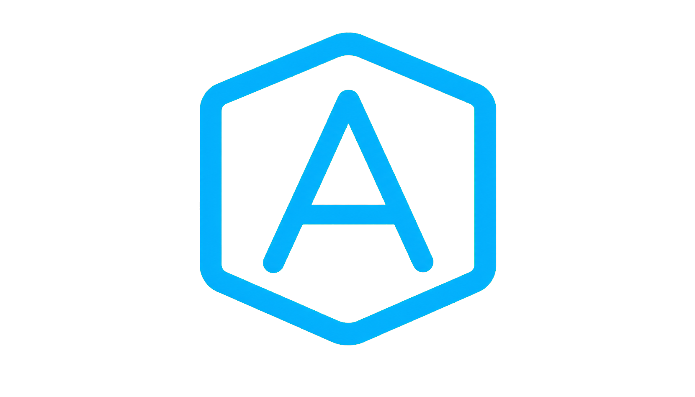

<p align="center">
  
</p>

# devcontainer-automated

`devcontainer-automated` is a macOS-only, opinionated helper script for people who want a nearly zero-config per-project devcontainer workflow without giving up host-native quality of life.

It lets you keep using your own terminal app, your host SSH agent, and the nice 1Password prompts, while opening VS Code directly in the right devcontainer, dropping your shell into that same container, and making `op` inside the devcontainer painless.

This is especially useful if you do not want to:

- live in the VS Code terminal
- choose between "SSH works in VS Code" or "SSH works in my shell"
- maintain different glue commands for every project
- manually click "Reopen in Container" or "Attach to Container"
- give up and run everything locally just because devcontainer setup is annoying

## What it does

- Opens VS Code directly inside the correct devcontainer
- Opens your host terminal into the same running container
- Forwards your host SSH agent into Colima so you can use 1Password prompts
- Passes the service accout token at container creation so `op` is ready inside the devcontainer
- Rebuilds only when needed: when the container does not exist, when it was removed, when the `.devcontainer` folder changed, or when you explicitly run `rebuild`

## Requirements

- A project directory that contains a `.devcontainer` folder
- Colima installed and running, with working `ssh colima` setup
- VS Code installed with the `code` command available in your `PATH`
- Dev Containers CLI installed (`devcontainer` command)
- Docker CLI installed (`docker` command)
- 1Password CLI installed (`op` command)

## 1Password requirement

To create a new devcontainer, the script needs access to a 1Password service account token.

This is not mandatory for every possible setup, but it is a very practical part of this workflow if you use `op` inside the devcontainer. You authenticate once on the host during container creation with the usual 1Password sign-in prompt, and after that you do not have to keep entering passwords inside the devcontainer.

Create a service account using the official 1Password documentation:

- [1Password Service Accounts](https://developer.1password.com/docs/service-accounts/)
- [Get started with 1Password Service Accounts](https://developer.1password.com/docs/service-accounts/get-started/)

The script reads the token from:

```text
op://<vault>/onepassword/OP_SERVICE_ACCOUNT_TOKEN
```

That means in 1Password you must have the following:

- the item name must be `onepassword`
- the field name must be `OP_SERVICE_ACCOUNT_TOKEN`
- retrieve `--vault` id with `op vault list` in a terminal

⚠️ Caution: Using `--token` instead puts the secret in plaintext on your host.

## Install

Make the script executable and put it on your `PATH`. For example:

```bash
chmod +x devcontainer-automated
mv devcontainer-automated ~/.local/bin/devcontainer-automated
```

Then start Colima:

```bash
colima start
```

## Usage

Run the script from the root of a project that has a `.devcontainer/` directory:

```bash
devcontainer-automated [options] [command]
```

Commands:

- no command: create or start the devcontainer, open VS Code, then open a shell
- `code`: create or start the devcontainer, then open VS Code only
- `shell`: create or start the devcontainer, then open a shell only
- `rebuild`: force-remove the existing container, recreate it, open VS Code, then open a shell

Flags:

- `--vault <vault>`: vault used to retrieve `OP_SERVICE_ACCOUNT_TOKEN`
- `--token <token>`: use a service account token directly instead of reading it from 1Password
- `--user <user>`: container user used for the interactive shell, defaults to `vscode`
- `--shell <shell>`: shell command used for the interactive shell, defaults to `bash`
- `--workspace <path>`: use a workspace path instead of the current directory, defaults to `/workspaces/<project-folder>`
- `--debug`: enable debug logs

## Recommended workflow

The intended workflow is simple:

1. Add the script to your `PATH`.
2. Open your normal terminal on the host.
3. `cd` into the project directory.
4. Run one command.

Example:

```bash
cd ~/dev/my-project
devcontainer-automated --vault <vault>
```

without changing directory first:

```bash
devcontainer-automated --workspace ~/dev/my-project --vault <vault>
```

with a custom container user:

```bash
devcontainer-automated --vault <vault> --user app
```

with `zsh` inside the container:

```bash
devcontainer-automated --vault <vault> --shell zsh
```

store one command per project, so you never type anything manually:

```bash
cd ~/dev/my-project && devcontainer-automated --vault <vault>
```

## Rebuild behavior

The script hashes the contents of the `.devcontainer` directory and stores that hash in a temp file.

In practice:

- if the container exists and the `.devcontainer` hash did not change, it reuses the container
- if the container exists but is stopped, it starts it
- if the container is missing, it creates it
- if the `.devcontainer` hash changed, it recreates the container
- if you run `rebuild`, it recreates the container no matter what

This keeps the workflow fast while still reacting to real devcontainer config changes.

## Why Colima

Colima is a better fit for this workflow because it is smaller and focused on giving you a local container runtime without a lot of extra product surface. If all you want is devcontainers on macOS, Docker Desktop can feel heavy for no real benefit here.

This project treats Colima as a practical bridge, not a forever choice. As soon as this workflow can be replaced cleanly by Apple Containers, future versions of the script will likely drop Colima support.