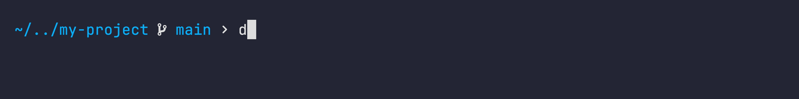

<p align="center">
  
</p>

# devcontainer-automated

`devcontainer-automated` is a **macOS-only**, opinionated helper script for people who want a *nearly zero-config* per-project devcontainer workflow without giving up host-native quality of life.

It lets you keep using **your own terminal app**, **your host SSH agent**, and the nice 1Password prompts, while opening VS Code directly in the right devcontain

### What it does :

- **One reusable workflow** instead of project-specific glue commands
- Opens VS Code in a devcontainer, without *"Reopen/Attach to Container"* prompts
- Opens your host terminal into the **same running container**
- Keeps SSH working in both VS Code and your host shell, including **1Password prompts**
- **Automated rebuilds**, only when needed *([Rebuild behavior](#rebuild-behavior))*



## Requirements

- A project directory that contains a `.devcontainer` folder
- [colima](https://formulae.brew.sh/formula/colima) installed and running, with a working `ssh colima` setup
- [vscode](https://formulae.brew.sh/cask/visual-studio-code) application installed, with the `code` command available
- [devcontainer](https://formulae.brew.sh/formula/devcontainer) CLI installed, with the `devcontainer` command available
- [docker](https://formulae.brew.sh/formula/docker) CLI installed, with the `docker` command available

## Install

Make the script executable and put it on your `PATH`. For example:

```bash
chmod +x devcontainer-automated
mv devcontainer-automated ~/.local/bin/devcontainer-automated
```

Then start **Colima**:

```bash
colima start
```

You can now start using `devcontainer-automated` in any folder.

## Template

By default, `devcontainer-automated init` initializes your project with the `.devcontainer` template from this repository. It is a **good starting point** if you want to bootstrap a new project quickly.

In practice, you will likely want **your own template** once you start accumulating customizations that should persist across all your projects.

The **preferred approach** is to fork this repository while keeping the same repository name, then use the flag `--source <your-github-username>` when running `init`.

This gives you a **versioned template** in your own repository, lets you evolve your setup over time, and also creates examples that other users can browse through the public forks to get inspired by different configurations.

If you prefer, you can also use `--template` instead of `--source` to initialize from a *local template* or a *custom repository URL*.

By default, this template:

- uses the `mcr.microsoft.com/devcontainers/base:ubuntu` base image
- mounts your host `~/.gitconfig` **read-only** into the container
- mounts your host `~/.ssh` **read-only** into the container
- mounts the **1Password SSH agent socket** at `/tmp/ssh-agent.sock`
- sets `SSH_AUTH_SOCK` inside the container
- runs `.devcontainer/onCreateCommand.sh` when the container is created

What it does on create:

- generates `~/.ssh/config` in the container with `IdentityAgent /tmp/ssh-agent.sock`
- includes `~/.ssh/1Password/config` automatically if it exists on the host
- copies `known_hosts` from the host into the container if available
- generates `~/.gitconfig` in the container by including the host Git config
- configures Git SSH signing support with `ssh-keygen`
- marks the workspace directory as a Git `safe.directory`

## Usage

Run the script from the **root of your project**:

```bash
devcontainer-automated [options] [command]
```

Commands:

- `init`: initialize the current directory with the default or a supplied template
- no command: create or start the devcontainer, open VS Code, then open a shell
- `code`: create or start the devcontainer, then open VS Code only
- `shell`: create or start the devcontainer, then open a shell only
- `rebuild`: force-remove the existing container, recreate it, open VS Code, then open a shell

Flags:

- `--debug`: enable debug logs
- `--help`: show the help message
- `--shell <shell>`: shell command used for the interactive shell, defaults to `bash`
- `--source <github-user>`: for `init`, use `https://github.com/<user>/devcontainer-automated.git`
- `--user <user>`: container user used for the interactive shell, defaults to `vscode`
- `--workspace <path>`: use a workspace path instead of the current directory, defaults to `/workspaces/<project-folder>`

<details>
<summary>Advanced options</summary>

You can optionally pass a [1Password service account](https://developer.1password.com/docs/service-accounts/get-started/) token through `remoteEnv` to keep `op` authenticated inside the devcontainer, **but this is insecure and not recommended**.

- `--vault <vault>`: read `OP_SERVICE_ACCOUNT_TOKEN`
- `--token <token>`: pass a service account token directly
- `--template <path|url>`: for `init`, use a custom repo URL or a local path containing `.devcontainer`

</details>

## Rebuild behavior

The script hashes the contents of the `.devcontainer` directory and stores that hash in a temp file.

In practice:

- if the container exists and the `.devcontainer` hash did not change, it **reuses** the container
- if the container is missing, it **creates** it
- if the `.devcontainer` hash changed, it **recreates** the container
- if you run `rebuild`, it recreates the container **no matter what**

This keeps the workflow **fast** while still reacting to real devcontainer config changes.

## Current implementation choices

**Colima** is a practical fit for this workflow today because it stays lightweight and focused on local container runtime needs, without the extra surface area of Docker Desktop. Contributions to make the script work cleanly with Docker Desktop or Apple Containers are welcome.

**1Password** is a practical fit for this workflow today because it is the SSH agent setup I'm currently using. Contributions to make the script work cleanly with SSH agents beyond 1Password are welcome.
