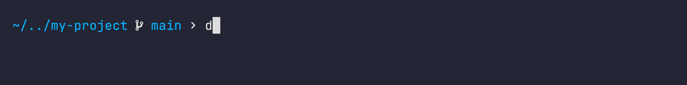

<p align="center">
  
</p>

# devcontainer-automated

`devcontainer-automated` is a small helper for starting, rebuilding, and entering per-project devcontainers from your terminal.

It is intentionally editor-agnostic. The script prepares the devcontainer; you can then connect to the running container from Zed or any other editor that supports Dev Containers.

### What it does

- Creates or starts a project devcontainer with `devcontainer up`
- Opens your terminal into the same running container
- Rebuilds only when the `.devcontainer` configuration changes
- Keeps SSH agent forwarding configurable across Linux and macOS
- Stores machine-specific paths in `~/.config/devcontainer-automated/config.toml`



## Requirements

- `devcontainer` CLI installed
- `docker` CLI installed
- An SSH agent socket if your container needs SSH access

On macOS, Colima is supported through the generated config. On Linux, the default config uses the local Docker daemon.

## Install

Make the script executable and put it on your `PATH`. For example:

```bash
chmod +x devcontainer-automated
mv devcontainer-automated ~/.local/bin/devcontainer-automated
```

Then enroll the machine:

```bash
devcontainer-automated enroll
```

The first normal run also prompts for enroll when the config file is missing and stdin is interactive.

## Config

`enroll` shows detected choices for each value, including a custom option, then writes:

```toml
[runtime]
type = "local"
docker_host = ""

[paths]
ssh_agent_socket = "/run/user/1000/keyring/ssh"
gitconfig = "/home/freeman/.gitconfig"
ssh_dir = "/home/freeman/.ssh"

[container]
shell = "bash"
```

The paths are the paths visible to the Docker daemon.

For Linux with local Docker, those are host paths. For macOS with Colima, `docker_host` is usually `ssh://colima`, and `ssh_agent_socket` points to the proxy socket created inside the Colima VM.

For SSH agents, candidates with loaded identities are listed before empty agents.

If a path cannot be detected, choose `Custom value` and enter the path manually.

To refresh detection:

```bash
devcontainer-automated enroll --force
```

## Template

By default, `devcontainer-automated init` initializes your project with the `.devcontainer` template from this repository.

The template:

- uses the `mcr.microsoft.com/devcontainers/base:ubuntu` base image
- mounts the configured host Git config into the container
- mounts the configured SSH agent socket at `/tmp/ssh-agent.sock`
- mounts the configured host SSH directory read-only
- runs `.devcontainer/onCreateCommand.sh` when the container is created

What it does on create:

- generates `~/.ssh/config` in the container with `IdentityAgent /tmp/ssh-agent.sock`
- includes `~/.ssh/1Password/config` automatically if it exists in the mounted SSH directory
- copies `known_hosts` from the mounted SSH directory if available
- generates `~/.gitconfig` in the container by including the mounted host Git config
- configures Git SSH signing support with `ssh-keygen`
- marks the workspace directory as a Git `safe.directory`

## Usage

Run the script from the root of your project:

```bash
devcontainer-automated [options] [command]
```

Commands:

- no command: create or start the devcontainer, then open a shell
- `enroll`: create or refresh the machine config
- `init`: initialize the current directory with the default or supplied template
- `up`: create or start the devcontainer without opening a shell
- `shell`: open a shell in the running devcontainer, creating it first if needed
- `rebuild`: force-remove the existing container, recreate it, then open a shell

Flags:

- `--debug`: enable debug logs
- `--force`: overwrite config when used with `enroll`
- `--help`: show the help message
- `--shell <shell>`: shell command used for the interactive shell, defaults to `bash`
- `--source <github-user>`: for `init`, use `https://github.com/<user>/devcontainer-automated.git`
- `--template <path|url>`: for `init`, use a custom repo URL or a local path containing `.devcontainer`
- `--workspace <path>`: use a workspace path instead of the current directory

<details>
<summary>Advanced options</summary>

You can optionally pass a [1Password service account](https://developer.1password.com/docs/service-accounts/get-started/) token through `remoteEnv` to keep `op` authenticated inside the devcontainer, **but this is insecure and not recommended**.

- `--vault <vault>`: read `OP_SERVICE_ACCOUNT_TOKEN`
- `--token <token>`: pass a service account token directly

</details>

## Rebuild behavior

The script hashes the contents of the `.devcontainer` directory and stores that hash in a temp file.

In practice:

- if the container exists and the `.devcontainer` hash did not change, it reuses the container
- if the container is missing, it creates it
- if the `.devcontainer` hash changed, it recreates the container
- if you run `rebuild`, it recreates the container no matter what

This keeps the workflow fast while still reacting to real devcontainer config changes.
